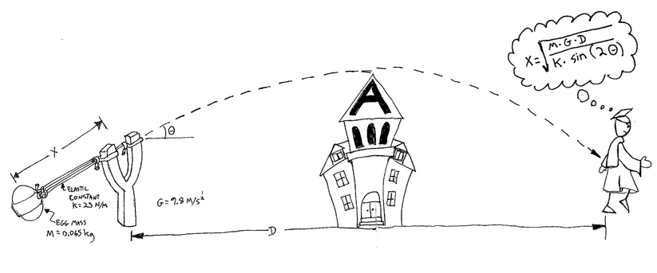

Beginning Python Class -- Lecture 1
===================================

Class Expectations
------------------

-  There is too much to cover in a class and effort will need to be put
   in outside of class to master concepts
-  Do Practice Exercises
-  If questions are off topic please ask me outside of lecture or during
   the practice lab time
-  Google is your friend - Learning to find answers to problems on your
   own is an essential part of scripting

-  Making fun of my Typos is not accepted -- :-)

Class Setup
-----------

I will lecture for about 30-40 minutes and allow between 15-25 min for
us to practice what we have talked about during lab time. During this
time all questions will be accepted and students will be able to get a
start on the homework problems.

Useful Links
------------

SkillSoft
~~~~~~~~~

Micron Employees have access to the skillsoft learning website. This can
be used as supplemental help if a topic is not understood from my
lectures. - In a browser type: "skillsoft/" to go to the skillsoft home
page - I found that Chrome didn't seem to work for videos and I needed
to use Internet Explorer - Search for "python" - Click on the "Python:
The Basics" We will be covering many of the same things that are covered
in this online lecture.

Optional free Textbook
~~~~~~~~~~~~~~~~~~~~~~

The following link is to a free Kindle Python textbook. You can use a
free Kindle reader from your amazon account to read this book.
https://www.amazon.com/gp/product/B01N1ZXVPL?ref_=pe_2601450_224568940_em_ti&redirect=true&pldnSite=1

PEP8 Style Guide
~~~~~~~~~~~~~~~~

PEP8 style guide should be used as a reference for styling decisions.
This document (http://legacy.python.org/dev/peps/pep-0008/) covers
topics like: - Indentation - Comments - Line Length These are a set of
standards that allow python developers to easily work on each others
code and avoid nasty syntax bugs caused by white space inconsistencies.

The Zen of Python is a guide line for Python design aphorisms.

.. code:: ipython3

    import this

.. parsed-literal::

    The Zen of Python, by Tim Peters
    
    Beautiful is better than ugly.
    Explicit is better than implicit.
    Simple is better than complex.
    Complex is better than complicated.
    Flat is better than nested.
    Sparse is better than dense.
    Readability counts.
    Special cases aren't special enough to break the rules.
    Although practicality beats purity.
    Errors should never pass silently.
    Unless explicitly silenced.
    In the face of ambiguity, refuse the temptation to guess.
    There should be one-- and preferably only one --obvious way to do it.
    Although that way may not be obvious at first unless you're Dutch.
    Now is better than never.
    Although never is often better than *right* now.
    If the implementation is hard to explain, it's a bad idea.
    If the implementation is easy to explain, it may be a good idea.
    Namespaces are one honking great idea -- let's do more of those!

Running Python in the Lab
-------------------------

Not everyone has a dedicated Windows machine that they can remote into,
and not everyone has their own Linux account. Therefore we are going to
use an online Python Interpreter to run our Python code for this class.
This way we can practice in the lab and students can practice at home
without having to install python on their PC. I will run python from my
machine during the lecture so that the process of running python from
the command line is understood.

Here is the link to the online Python Interpreter --
https://repl.it/languages/python3

Python and Python3 are Different
--------------------------------

For the purposes of this class we will be primarily using Python3
version 3.5. Just know that code from python2.X and python3.X are not
compatible. They are not super different from a syntax or data structure
perspective but are quite different in the way that they internally
manage data. Some differences are shown below from Python2.X to
Python3.X: - print() needs parentheses - it's a function - iterate over
dictionaries using dict.items() - strings and bytestrings are explicitly
different, and strings by default are typically Unicode - different
syntax for exception handling - many functions return iterable
objects/generators, not lists (map, zip, etc) - xrange() has been
replaced with range()

At Micron the version of python that is used as the default is Python
version 2.6. To follow along with this class you can launch python3 by
typing ``/u/qaeng/anaconda3/bin/python`` into the terminal.

If you ever need to know what version of python you are currently
running you can use the following python snippet.

.. code:: ipython3

    import sys
    print( sys.version )

.. parsed-literal::

    3.6.0 (default, Dec 24 2016, 08:01:42) 
    [GCC 4.2.1 Compatible Apple LLVM 8.0.0 (clang-800.0.42.1)]

The snippet above says that I am currently running python version 3.6.0
at the time of creating these lecture documents.

Motivation
==========

Computers are very good and happy to do the same thing over and over.
Automation of tasks is the main reason that I started working with
computers. I wanted to learn how to make the computer work for me and do
things automatically that I needed.

Getting Started with Python
===========================

Code or Source Code in the context of this class will be defined as a
sequence of instructions that the computer can interpret/compile into a
useable/understandable instruction.

Syntax
------

Syntax in the context of computer code is the set of rules that defines
the combinations of symbols that are considered to be a correctly
structured document or fragment in that language.

Python was designed to have a very clean look to the code. The
compromise is that to correctly interpret the code python elected to use
whitespace as a syntactical character. The last language to use
syntactical whitespace was Fortran which was created by IBM in 1957.

Languages such as Perl and C ignore whitespace and rely on other special
characters that often mean different things in different contexts. This
allowed the programmer to develop their own style independent of the
format of the code.

A quick example is shown below:

::

    foreach my $a (@list_of_numbers){
        print "value of a: $a\n";
    }

The exact same Perl code could be written like:

::

    foreach my $a (@list_of_numbers){ print "value of a: $a\n"; }

This is because one of the characters that Perl uses to group
instructions are "{}" (brackets).

Python avoids this type of problem by requiring whitespace syntax to
group sequences of instruction:

.. code:: python

    for a in list_of_numbers:
        print( "Value of a: " + str(a))

Since the 'print' statement is executed during the loop it is
nested/grouped inside the loop with 4 spaces. (More on loops later in
Lecture 2)

Read, Evaluate, Print, Loop (REPL) -- Playing directly with the Interpreter
---------------------------------------------------------------------------

The Python Interpreter can be launched from the command line in Linux
simply by typing: ``python`` or in our case for python3
``/u/qaeng/anaconda3/bin/python``. This starts the interpreter which
will wait for us to run commands. This allows us to play with commands
one line at a time. When we press the 'Enter' key the interpreter
'Reads' what we input, 'Evaluates' what we input, and 'Prints' the
result, and then waits for the next input.

Data Types, Variables, and Comments
-----------------------------------

-  A Data Type is a particular kind of data and defines the values that
   it can take in a program.
-  A variable is a storage location associated with a symbolic name or
   identifier.
-  A comment is text that is added to a program that is not executed in
   order to add notes to the code.

   -  Comments are denoted with the ``#`` character.

Mastering the predefined data types is a fundamental part of learning to
program because it allows you to take advantage of built-in
functionality of Python. We will not be covering member functions that
are associated with the more complex data types this lecture but I will
hint at them.

Basic Data Types ( Primitives )
-------------------------------

There are other data types that will not be covered in this lecture such
as 'bytearray' but the Data Types which are covered are by far the most
common.

int
~~~

'int' means integer. A whole number positive or negative including zero.
Python defaults most calculations to avoid some interesting behaviors,
but it is good to understand what is going on so let's explore those
now.

.. code:: ipython3

    x = 5
    # type is a function that will give us the data type of what it recieves
    # Print is a function that will output to the console, (print what we want to see)
    print( x, type(x) ) 
    print( int(x/2) )

.. parsed-literal::

    5 <class 'int'>
    2

We all know that 5 divided by 2 is 2.5 but integers can only store whole
numbers and therefore the computer truncates 2.5 to 2 as shown above.

Float
~~~~~

'float' means a floating point number. A floating point number is a
number with a decimal point. Python tries to be smart when determining
what kind of data something is as demonstrated below.

.. code:: ipython3

    x = 5
    print( x, type( x ))
    y = x/2
    print( y, type( y ))

.. parsed-literal::

    5 <class 'int'>
    2.5 <class 'float'>

What is x = 10? Will I get a int or a float?

Bool
~~~~

'bool' is a boolean value, meaning that it can be either true or false.
There are keywords in python for True and False that are of type 'bool'.
In python: 0, the keyword None, and empty sets, are considered to be
false and all other values are considered true.

.. code:: ipython3

    print( type(True), type(False))
    print( bool(1), bool(2), bool(-1), bool(0), bool(None), bool([]), bool(['a']))

.. parsed-literal::

    <class 'bool'> <class 'bool'>
    True True True False False False True

Sequence Data Types
-------------------

Sequence Data Types can be a whole structure or individually look at the
parts with an index. An index is just a number that tells the data type
which little piece inside we want to look at.

String
~~~~~~

String is a sequence of characters. This is the common way to store and
manipulate text. Strings can contain: letters, numerals, symbols, and
punctuation marks. Python can also be used to store Unicode characters.
Unicode characters have the ability to encode many more characters than
the ones available on the keyboard.

Unicode characters can be looked up here:
http://www.rapidtables.com/code/text/unicode-characters.htm

.. code:: ipython3

    x = "Dallin Marshall"
    print( type(x), x )
    y = "This is a sentence with numbers (3.14) and special characters (?.,<>&)."
    print( type(y), y )
    # These are Unicode characters, see print out below
    z = "\u20A9, \u20AA, \u03B1, \u03B2" 
    print( type(z), z )

.. parsed-literal::

    <class 'str'> Dallin Marshall
    <class 'str'> This is a sentence with numbers (3.14) and special characters (?.,<>&).
    <class 'str'> ₩, ₪, α, β

Python uses two characters to denote strings, single quotes (``'``) and
double quotes (``"``). To split strings on to multiple lines you can
either do so by explicitly using the ``\n`` character with regular
quotes (',") or with the ``"""`` multi-line string quotes. In multi-line
string quote can span multiple lines of code ``"""`` and print out the
same way.

.. code:: ipython3

    x = "Dallin Marshall" # double quotes
    x1 = 'Dallin Marshall' # single quotes
    print( x, x1 )
    
    y = "\u20A9, \u20AA, \u03B1, \u03B2"
    y1 = '\u20A9, \u20AA, \u03B1, \u03B2'
    print( y, y1 )
    
    z = "Dallin\nMarshall" # \n is the escape character to denote new line
    z1 = """Dallin
    Marshall"""
    print( z )
    print( z1 )

.. parsed-literal::

    Dallin Marshall Dallin Marshall
    ₩, ₪, α, β ₩, ₪, α, β
    Dallin
    Marshall
    Dallin
    Marshall

There is a built-in function that can convert data types to strings.
This function can come in handy when receiving the input from a user,
manipulating the data, and then converting it back to a string.

.. code:: ipython3

    # This is what does not work
    x = "26"
    print( x / 2 )

::

    ---------------------------------------------------------------------------

    TypeError                                 Traceback (most recent call last)

    <ipython-input-8-87ba7c8a6868> in <module>()
          1 # This is what does not work
          2 x = "26"
    ----> 3 print( x / 2 )
    

    TypeError: unsupported operand type(s) for /: 'str' and 'int'

.. code:: ipython3

    # This is how to convert from a string to a number
    x = "26"
    print( type(x) )
    x = int(x)
    print( type(x) )
    # This is the string function. It converts things to strings
    x = str(x/2)
    print( type( x ) )
    print( x )

.. parsed-literal::

    <class 'str'>
    <class 'int'>
    <class 'str'>
    13.0

The reason that strings are a sequence data type is because the
individual elements that make up the string can be referenced
independently. Don't worry too much if you don't understand all of what
is going on with the indexes. There will be much more on indexing in the
list section. For now this is just a quick look to show you can we can
look at the individual characters of a string.

.. code:: ipython3

    x = "Dallin Marshall"
    print( x[0] ) # First Character of x. Remember that Python counts starting at 0
    print( x[4] )
    print( x[-4] )
    print( x[7:] ) # Print location 7 to the end
    print( x[::] ) # Print whole string
    print( x[::-1] ) # Print the string moving one space at a time backwards
    print( x[0::2] ) # start with 0, do the whole string, moving at a step of 2

.. parsed-literal::

    D
    i
    h
    Marshall
    Dallin Marshall
    llahsraM nillaD
    Dli asal

Strings have many member functions which we will talk about later in the
class. Member functions are other functionality that certain data types
provide to the user. More information about strings can be found here:
https://docs.python.org/3/library/stdtypes.html#string-methods

Strings have the following member functions:

.. code:: ipython3

    x = str
    [method for method in dir(x) if callable(getattr(x, method)) 
            and not method.startswith( '__' )]

.. parsed-literal::

    ['capitalize',
     'casefold',
     'center',
     'count',
     'encode',
     'endswith',
     'expandtabs',
     'find',
     'format',
     'format_map',
     'index',
     'isalnum',
     'isalpha',
     'isdecimal',
     'isdigit',
     'isidentifier',
     'islower',
     'isnumeric',
     'isprintable',
     'isspace',
     'istitle',
     'isupper',
     'join',
     'ljust',
     'lower',
     'lstrip',
     'maketrans',
     'partition',
     'replace',
     'rfind',
     'rindex',
     'rjust',
     'rpartition',
     'rsplit',
     'rstrip',
     'split',
     'splitlines',
     'startswith',
     'strip',
     'swapcase',
     'title',
     'translate',
     'upper',
     'zfill']

List
~~~~

Lists in python are special objects that store groups of items. Lists
are denoted with the ``[]`` characters. Keep in mind that python is what
is called a zero-based language. Therefore the first item in a list is
the 0th element.

Lists can also be used to store collections of data that are not of the
same data types.

.. code:: ipython3

    x = [1, 2, 3, 4, 5, 6, 7, 8 ,9, 0]
    print( type( x ) )
    print( x[3] )
    print( x[7] )
    
    # y could be a structure that stores data about a person:
    #     Name             age   JobTitle   favNumbers
    y = ["Dallin Marshall", 26, "Engineer", [1,2,3,4]]
    print( y )

.. parsed-literal::

    <class 'list'>
    4
    8
    ['Dallin Marshall', 26, 'Engineer', [1, 2, 3, 4]]

Lists can be indexed in many ways: Backwards, Forwards, with a
particular increment, or partition. A partition is just a smaller window
of the data type.

Indexes are used to tell python what element we want to look at in the
same way as strings. Indexes have the form of ``[begin:end:increment]``.
If a value is not given then python assumes the maximum value.

List elements can also be changed.

.. code:: ipython3

    x = [0,1,2,3,4,5,6,7,8,9,10,11,12,13,14,15,16,17,18,19]
    print( x )
    print( x[5] ) # print 5th element
    print( x[-11] ) # print the negative 11th element
    # Everything below this point is considered a partition of x ( a sub-set of x )
    print( x[2:8] ) # print from element 2 to right before element 8.
    print( x[:10] ) # print elements 0 to 9
    print( x[::2] ) # print every other element of x
    print( x[::3] ) # print every third element of x
    
    x[10] = "Dallin Marshall"
    print( x )

.. parsed-literal::

    [0, 1, 2, 3, 4, 5, 6, 7, 8, 9, 10, 11, 12, 13, 14, 15, 16, 17, 18, 19]
    5
    9
    [2, 3, 4, 5, 6, 7]
    [0, 1, 2, 3, 4, 5, 6, 7, 8, 9]
    [0, 2, 4, 6, 8, 10, 12, 14, 16, 18]
    [0, 3, 6, 9, 12, 15, 18]
    [0, 1, 2, 3, 4, 5, 6, 7, 8, 9, 'Dallin Marshall', 11, 12, 13, 14, 15, 16, 17, 18, 19]

Lists have many member functions which we will talk about later in the
class. Member functions are other functionality that certain data types
provide to the user. More information about lists can be found here:
https://docs.python.org/3.5/tutorial/datastructures.html#

We will cover more advanced list creation such as list comprehension in
a future lecture.

Lists have the following member functions:

.. code:: ipython3

    x = list
    [method for method in dir(x) if callable(getattr(x, method))
            and not method.startswith( '__' )]

.. parsed-literal::

    ['append',
     'clear',
     'copy',
     'count',
     'extend',
     'index',
     'insert',
     'pop',
     'remove',
     'reverse',
     'sort']

Tuple
~~~~~

Tuples are like lists except that they are immutable. This means that
you can't change the elements once the tuple is assigned to a variable.
Tuples are denoted with the ``()`` characters.

.. code:: ipython3

    x = (0,1,2,3,4,5,6,7,8,9)
    print( type( x ) )
    x[4] = 100

.. parsed-literal::

    <class 'tuple'>

::

    ---------------------------------------------------------------------------

    TypeError                                 Traceback (most recent call last)

    <ipython-input-15-f4cb124ea3e9> in <module>()
          1 x = (0,1,2,3,4,5,6,7,8,9)
          2 print( type( x ) )
    ----> 3 x[4] = 100
    

    TypeError: 'tuple' object does not support item assignment

Tuples have many member functions which we will talk about later in the
class. Member functions are other functionality that certain data types
provide to the user. Tuples have relatively few methods associated with
them. This is because of their immutable nature.

Tuples have the following member functions:

.. code:: ipython3

    x = tuple
    [method for method in dir(x) if callable(getattr(x, method))
            and not method.startswith( '__' )]

.. parsed-literal::

    ['count', 'index']

Collection and Mapping Data Types
---------------------------------

Dictionary
~~~~~~~~~~

Dictionaries are one of the most useful data types that Python provides
to the users. These structures are known by different names in other
languages. For example in C++ these are Maps and in Perl these are
Hashes.

Essentially a Dictionary is a way to point one value to another. This
could be very handy in many applications where data relates to other
data. For example where I want to relate some information about myself.
Dictionaries are denoted with the ``{}`` characters.

.. code:: ipython3

    dallin = {'age': 26, 
              'college_team': 'USU', 
              'favColor': 'Blue', 
              'email': 'dmarshall@micron.com'}
    print( type( dallin ) )
    print( "Dallin's Age is: " + str(dallin['age']))
    print( "Dallin's Email is: " + dallin['email']) 
    # why did I not need to use the str function here.

.. parsed-literal::

    <class 'dict'>
    Dallin's Age is: 26
    Dallin's Email is: dmarshall@micron.com

Dictionaries have many member functions which we will talk about later
in the class. Member functions are other functionality that certain data
types provide to the user. More information about dictionaries can be
found here:
https://docs.python.org/3/tutorial/datastructures.html#dictionaries

Dictionaries have the following member functions:

.. code:: ipython3

    x = dict
    [method for method in dir(x) if callable(getattr(x, method))
            and not method.startswith( '__' )]

.. parsed-literal::

    ['clear',
     'copy',
     'fromkeys',
     'get',
     'items',
     'keys',
     'pop',
     'popitem',
     'setdefault',
     'update',
     'values']

Practice Problems
=================

There is one more function that I will introduce this week that will
allow your programs to be a little more flexible and accept user input.
The input function stores a string of the value input by the user into
the assigned variable.

.. code:: ipython3

    # input waits for the user to type in a value. I typed in 3.1415
    x = input( "Please give me a number: ") 
    print( type( x ) )
    print( "The number that you gave me is: " + x )

.. parsed-literal::

    Please give me a number: 3.1415
    <class 'str'>
    The number that you gave me is: 3.1415

Practice Problem 1
------------------

Accept input from the user and then reverse the string and print it back
to the user.

Practice Problem 2
------------------

Practice making a dictionary of dictionaries that follows the same
format as I demonstrated in the dictionary section for each member.

.. code:: python

    {'age': 26, 
     'college_team': 'USU', 
     'favColor': 'Blue', 
     'email': 'dmarshall@micron.com'}

Add entries for yourself, me (dallin), and your supervisor.

Once the dictionary or dictionaries is complete you should be able to
access elements as follows:

.. code:: python

    x['dallin']['age']

Practice Problem 3
------------------

An industrious USU freshman wishes to conduct an experiment wherein a
0.065 Kg raw egg is to be launched over the top of Old Main Hall using a
slingshot with ideal elastics and delivered to an otherwise preoccupied
professor travelling across campus.

   title

Create a program that accepts two arguments (inputs) corresponding to
Theta(degrees) and D(meters) in the diagram above which will tell us how
far we will need to pull back our slingshot to hit our professor with an
egg.

Hint you can make use of the math library to facilitate solving this
problem. Add the ``import math`` line at the top of your file and you
will have access to math function. More info on the math module here:
https://docs.python.org/3.5/library/math.html

.. code:: ipython3

    import math
    x = math.sqrt(100)
    # The Sin function requires it's argument to be in radians
    # Therefore we can use the math.radians function to convert degrees to radians.
    y = math.sin( math.radians(45) )
    
    print( x, y )

.. parsed-literal::

    10.0 0.7071067811865475

Please format your result in the following way - "You need to pull the
slingshot back ### meters to hit the Professor."
